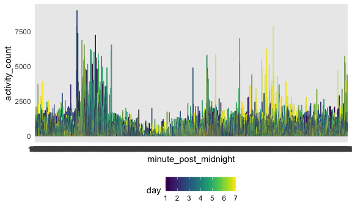
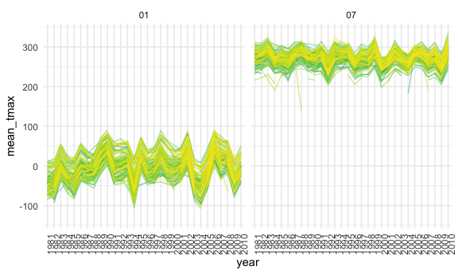
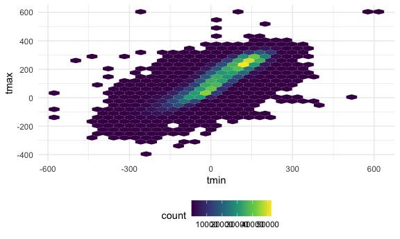
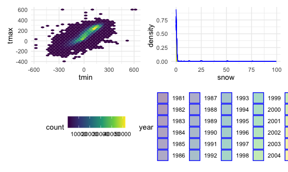

p8105_hw3_glj2117
================
2022-10-15

## Problem 1- Instacart data

The goal is to do some exploration of this dataset. To that end, write a
short description of the dataset, noting the size and structure of the
data, describing some key variables, and giving illstrative examples of
observations. Then, do or answer the following (commenting on the
results of each):

How many aisles are there, and which aisles are the most items ordered
from? Make a plot that shows the number of items ordered in each aisle,
limiting this to aisles with more than 10000 items ordered. Arrange
aisles sensibly, and organize your plot so others can read it. Make a
table showing the three most popular items in each of the aisles “baking
ingredients”, “dog food care”, and “packaged vegetables fruits”. Include
the number of times each item is ordered in your table. Make a table
showing the mean hour of the day at which Pink Lady Apples and Coffee
Ice Cream are ordered on each day of the week; format this table for
human readers (i.e. produce a 2 x 7 table).

``` r
library(p8105.datasets)
  data("instacart")

nrow(instacart) #1384617
```

    ## [1] 1384617

``` r
ncol(instacart) #15
```

    ## [1] 15

``` r
instacart %>% 
  group_by(aisle_id) %>% 
  count() %>% 
  print(n = 150) #134 aisles
```

    ## # A tibble: 134 × 2
    ## # Groups:   aisle_id [134]
    ##     aisle_id      n
    ##        <int>  <int>
    ##   1        1   2936
    ##   2        2   3873
    ##   3        3  17449
    ##   4        4   9917
    ##   5        5   2905
    ##   6        6   1795
    ##   7        7   1526
    ##   8        8   1501
    ##   9        9   9736
    ##  10       10    448
    ##  11       11   1346
    ##  12       12   1628
    ##  13       13   4133
    ##  14       14   5123
    ##  15       15    909
    ##  16       16  16052
    ##  17       17  13088
    ##  18       18    725
    ##  19       19  10620
    ##  20       20   3070
    ##  21       21  41699
    ##  22       22   1469
    ##  23       23   6917
    ##  24       24 150473
    ##  25       25   2773
    ##  26       26   8392
    ##  27       27   1839
    ##  28       28   1243
    ##  29       29   2864
    ##  30       30   3548
    ##  31       31  23228
    ##  32       32  13460
    ##  33       33    628
    ##  34       34   3341
    ##  35       35   5208
    ##  36       36  10575
    ##  37       37  22676
    ##  38       38  18221
    ##  39       39   1084
    ##  40       40   1612
    ##  41       41   2885
    ##  42       42   4727
    ##  43       43   5054
    ##  44       44    548
    ##  45       45  11453
    ##  46       46    962
    ##  47       47   1969
    ##  48       48   3144
    ##  49       49   5608
    ##  50       50   6741
    ##  51       51   5188
    ##  52       52   9729
    ##  53       53  12356
    ##  54       54  12694
    ##  55       55    532
    ##  56       56   1109
    ##  57       57   3803
    ##  58       58   1532
    ##  59       59  11774
    ##  60       60   1621
    ##  61       61   9980
    ##  62       62   1088
    ##  63       63   6134
    ##  64       64   4742
    ##  65       65   1612
    ##  66       66   7007
    ##  67       67  15142
    ##  68       68    634
    ##  69       69  15109
    ##  70       70   1205
    ##  71       71   1729
    ##  72       72   9743
    ##  73       73    746
    ##  74       74   3870
    ##  75       75   4636
    ##  76       76    719
    ##  77       77  16279
    ##  78       78  19592
    ##  79       79   7661
    ##  80       80    858
    ##  81       81  12679
    ##  82       82    306
    ##  83       83 150609
    ##  84       84  32644
    ##  85       85   2906
    ##  86       86  19875
    ##  87       87    891
    ##  88       88  12102
    ##  89       89   4719
    ##  90       90   1062
    ##  91       91  26240
    ##  92       92  13198
    ##  93       93   9851
    ##  94       94   9376
    ##  95       95   3241
    ##  96       96  16957
    ##  97       97   1094
    ##  98       98  14350
    ##  99       99   3996
    ## 100      100   8251
    ## 101      101   1067
    ## 102      102    328
    ## 103      103    504
    ## 104      104   9279
    ## 105      105   4758
    ## 106      106  12813
    ## 107      107  31269
    ## 108      108  12820
    ## 109      109    534
    ## 110      110   4882
    ## 111      111   1959
    ## 112      112  23635
    ## 113      113    294
    ## 114      114   5894
    ## 115      115  36617
    ## 116      116  22453
    ## 117      117  12532
    ## 118      118    539
    ## 119      119    922
    ## 120      120  55240
    ## 121      121  16201
    ## 122      122   3159
    ## 123      123  78493
    ## 124      124    967
    ## 125      125   1463
    ## 126      126   1048
    ## 127      127   2137
    ## 128      128   8353
    ## 129      129   8870
    ## 130      130   6352
    ## 131      131  11298
    ## 132      132    287
    ## 133      133    897
    ## 134      134    461

## Problem 2

Accelerometers have become an appealing alternative to self-report
techniques for studying physical activity in observational studies and
clinical trials, largely because of their relative objectivity. During
observation periods, the devices measure “activity counts” in a short
period; one-minute intervals are common. Because accelerometers can be
worn comfortably and unobtrusively, they produce around-the-clock
observations.

This problem uses five weeks of accelerometer data collected on a 63
year-old male with BMI 25, who was admitted to the Advanced Cardiac Care
Center of Columbia University Medical Center and diagnosed with
congestive heart failure (CHF). The data can be downloaded here. In this
spreadsheet, variables activity.\* are the activity counts for each
minute of a 24-hour day starting at midnight.

    Load, tidy, and otherwise wrangle the data. Your final dataset should include all originally observed variables and values; have useful variable names; include a weekday vs weekend variable; and encode data with reasonable variable classes. Describe the resulting dataset (e.g. what variables exist, how many observations, etc).

``` r
accel_data = read.csv("accel_data.csv") %>% 
  janitor::clean_names() %>% 
  pivot_longer(
    activity_1:activity_1440,
    names_to = "minute_post_midnight",
    names_prefix = "activity_",
    values_to = "activity_count") %>% 
 mutate(day = recode(day, "Monday" = 1, "Tuesday" = 2, "Wednesday" = 3, "Thursday" = 4, "Friday" = 5, "Saturday" = 6, "Sunday" = 7)) %>% 
  mutate(weekend_vs_weekday = if_else(day >= 6, "weekend", "weekday"))
```

The resulting dataset includes 50400 rows of data observationsand 6
variables. The data span 29 days over 5 weeks. With `day_id` indicating
the day (1-29), day indicating the day of the week (where 1 = Monday and
7 = Sunday), `minute_post_midnight` indicating the time during the day
at which the observation was taken, and `activity_count` being the
metric of activity during that given minute of time. The
`weekend_vs_weekday` column simply denotes whether the data were
collected on a weekday or on a weekend day.

    Traditional analyses of accelerometer data focus on the total activity over the day. Using your tidied dataset, aggregate across minutes to create a total activity variable for each day, and create a table showing these totals. Are any trends apparent?

    ```r
    accel_data %>% 
      group_by(day, day_id) %>% 
      summarize(sum(activity_count)) %>% 
     knitr::kable(digits = 1)

    ## `summarise()` has grouped output by 'day'. You can override using the `.groups`
    ## argument.

| day | day_id | sum(activity_count) |
|----:|-------:|--------------------:|
|   1 |      2 |             78828.1 |
|   1 |      9 |            295431.0 |
|   1 |     16 |            685910.0 |
|   1 |     23 |            409450.0 |
|   1 |     30 |            389080.0 |
|   2 |      6 |            307094.2 |
|   2 |     13 |            423245.0 |
|   2 |     20 |            381507.0 |
|   2 |     27 |            319568.0 |
|   2 |     34 |            367824.0 |
|   3 |      7 |            340115.0 |
|   3 |     14 |            440962.0 |
|   3 |     21 |            468869.0 |
|   3 |     28 |            434460.0 |
|   3 |     35 |            445366.0 |
|   4 |      5 |            355923.6 |
|   4 |     12 |            474048.0 |
|   4 |     19 |            371230.0 |
|   4 |     26 |            340291.0 |
|   4 |     33 |            549658.0 |
|   5 |      1 |            480542.6 |
|   5 |      8 |            568839.0 |
|   5 |     15 |            467420.0 |
|   5 |     22 |            154049.0 |
|   5 |     29 |            620860.0 |
|   6 |      3 |            376254.0 |
|   6 |     10 |            607175.0 |
|   6 |     17 |            382928.0 |
|   6 |     24 |              1440.0 |
|   6 |     31 |              1440.0 |
|   7 |      4 |            631105.0 |
|   7 |     11 |            422018.0 |
|   7 |     18 |            467052.0 |
|   7 |     25 |            260617.0 |
|   7 |     32 |            138421.0 |

The trends days 4, 10, 16, 29 have the highest activity counts (in the
600,000s, while most of the other days fall in the \~200,000-400,000
range). There are two drastically low days for activity count, day 24 an
day 31 (both within the last two weeks of the data collection). In terms
of patterns by weekday, the weekdays seem to have realtively
stable/similar activity counts, while increasing a bit on the weekends
(except fot those two Saturdays with low points in week 5).

    Accelerometer data allows the inspection activity over the course of the day. Make a single-panel plot that shows the 24-hour activity time courses for each day and use color to indicate day of the week. Describe in words any patterns or conclusions you can make based on this graph.


    ```r
    accel_data %>% 
      ggplot(aes(x = minute_post_midnight, y = activity_count)) +
      geom_line(aes(color = day)) +
      viridis::scale_color_viridis(
        name = "day" 
     )


It is difficult to make many conclusions based on this graph, as it
extremely busy, due to including so many datapoints. However, it is
interesting to see (via the color distribution) thatactivity count stays
relatively stable throughout the week and throughout the day. The
outliers to the stability seem to be day 7 (Sunday) towards the end of
the days, and a few mid-week points (days 2-4) in the beginning of the
days.

## Problem 3

The goal is to do some exploration of this dataset. To that end, write a
short description of the dataset, noting the size and structure of the
data, describing some key variables, and indicating the extent to which
missing data is an issue. Then, do or answer the following (commenting
on the results of each):

``` r
library(p8105.datasets)
data(ny_noaa)

ny_noaa %>% 
  janitor::clean_names()
```

    ## # A tibble: 2,595,176 × 7
    ##    id          date        prcp  snow  snwd tmax  tmin 
    ##    <chr>       <date>     <int> <int> <int> <chr> <chr>
    ##  1 US1NYAB0001 2007-11-01    NA    NA    NA <NA>  <NA> 
    ##  2 US1NYAB0001 2007-11-02    NA    NA    NA <NA>  <NA> 
    ##  3 US1NYAB0001 2007-11-03    NA    NA    NA <NA>  <NA> 
    ##  4 US1NYAB0001 2007-11-04    NA    NA    NA <NA>  <NA> 
    ##  5 US1NYAB0001 2007-11-05    NA    NA    NA <NA>  <NA> 
    ##  6 US1NYAB0001 2007-11-06    NA    NA    NA <NA>  <NA> 
    ##  7 US1NYAB0001 2007-11-07    NA    NA    NA <NA>  <NA> 
    ##  8 US1NYAB0001 2007-11-08    NA    NA    NA <NA>  <NA> 
    ##  9 US1NYAB0001 2007-11-09    NA    NA    NA <NA>  <NA> 
    ## 10 US1NYAB0001 2007-11-10    NA    NA    NA <NA>  <NA> 
    ## # … with 2,595,166 more rows

``` r
view(ny_noaa)
```

    The dataset is 2595176 observations long, and 7 variables wide. Data are missing for all variables for early November 2007, as well as late July/early August 2008, and intermittently betwwen August and October of 2009. Additionally, tmin and tmax are missing for many dates, which can impact the accuracy of some of the summary statistics (such as mean) we want to calculate. 

Do some data cleaning. Create separate variables for year, month, and
day. Ensure observations for temperature, precipitation, and snowfall
are given in reasonable units. For snowfall, what are the most commonly
observed values? Why?

``` r
ny_noaa = ny_noaa %>% 
  separate(col = 'date', into = c('year', 'month', 'day'), sep = '-')

ny_noaa %>% 
   group_by(snow) %>% 
    summarize(n_obs = n()) %>% 
    arrange(desc(n_obs))
```

    ## # A tibble: 282 × 2
    ##     snow   n_obs
    ##    <int>   <int>
    ##  1     0 2008508
    ##  2    NA  381221
    ##  3    25   31022
    ##  4    13   23095
    ##  5    51   18274
    ##  6    76   10173
    ##  7     8    9962
    ##  8     5    9748
    ##  9    38    9197
    ## 10     3    8790
    ## # … with 272 more rows

The most commonly observed values for snowfall are 0 mm, 25 mm, and 13
mm. There are also 381221 NA values for snowfall, the second-most behind
0 mm. This is likely because there are many days without snowfall in the
summer months, or where snowfall went unreported.

    Make a two-panel plot showing the average max temperature in January and in July in each station across years. Is there any observable / interpretable structure? Any outliers?

    ```r
    ny_noaa = ny_noaa %>% 
      mutate(tmax = as.numeric(tmax))

    ny_noaa = ny_noaa %>% 
      mutate(tmin = as.numeric(tmin))

    month_tmax_min = ny_noaa %>% 
      group_by(id, year, month) %>% 
      summarize(
      mean_tmax = mean(tmax, NaN.rm = TRUE), 
      mean_tmin = mean(tmin, NaN.rm = TRUE)
    )

    ## `summarise()` has grouped output by 'id', 'year'. You can override using the
    ## `.groups` argument.

``` r
month_tmax_min %>% 
  filter(month %in% c("01", "07")) %>% 
    ggplot(aes(x = year, y = mean_tmax, group = id)) + 
    geom_line(aes(color = id), alpha = .5) + 
    theme(legend.position = "none") + 
    theme(axis.text.x = element_text(angle = 90, hjust = 1)) + 
    facet_grid(.~ month)
```

    ## Warning: Removed 6007 row(s) containing missing values (geom_path).


Make a two-panel plot showing (i) tmax vs tmin for the full dataset
(note that a scatterplot may not be the best option); and (ii) make a
plot showing the distribution of snowfall values greater than 0 and less
than 100 separately by year.

``` r
tmax_tmin =
  ny_noaa %>% 
  ggplot(aes(x = tmin, y = tmax)) +
  geom_hex()
  

tmax_tmin
```

    ## Warning: Removed 1136276 rows containing non-finite values (stat_binhex).



``` r
snow_plot = ny_noaa %>% 
  filter(snow %in% (0:100)) %>% 
  ggplot(aes(x = snow, fill = year)) + 
  geom_density(alpha = .4, adjust = .5, color = "blue")


tmax_tmin + snow_plot
```

    ## Warning: Removed 1136276 rows containing non-finite values (stat_binhex).


